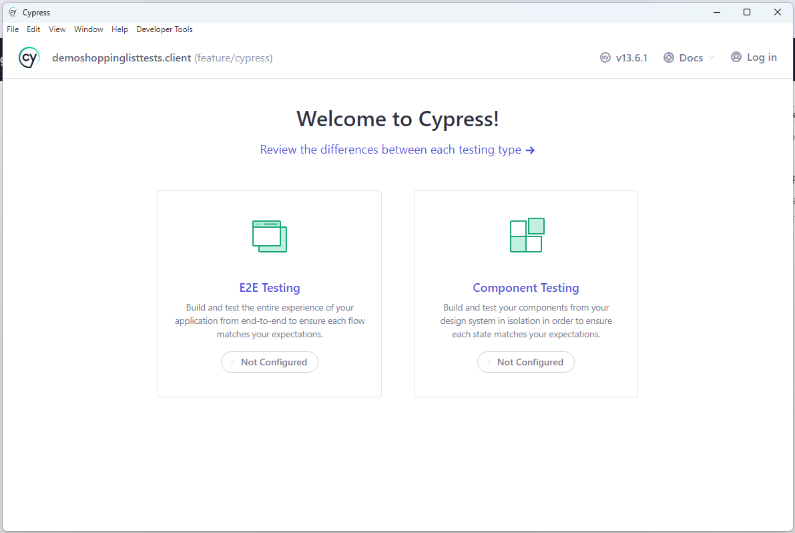
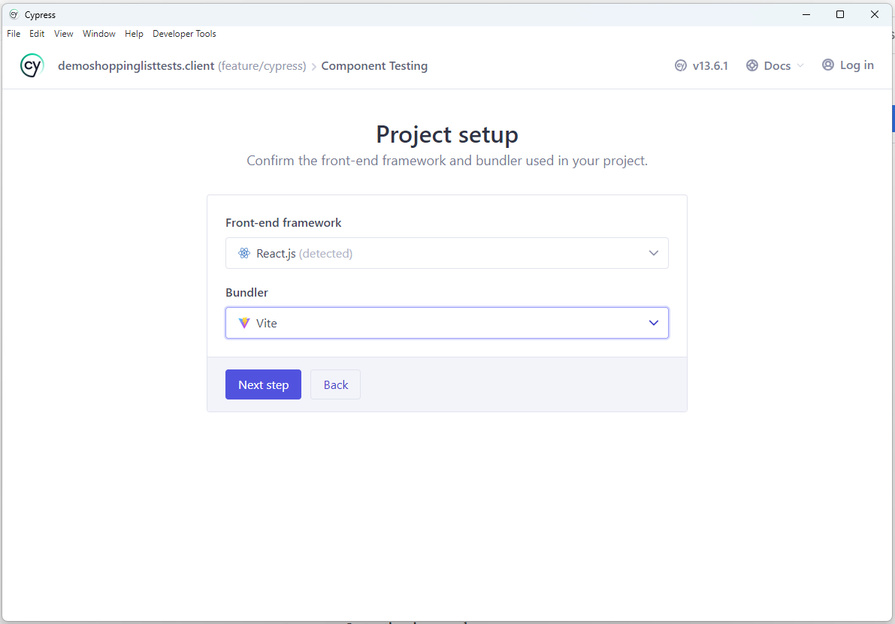
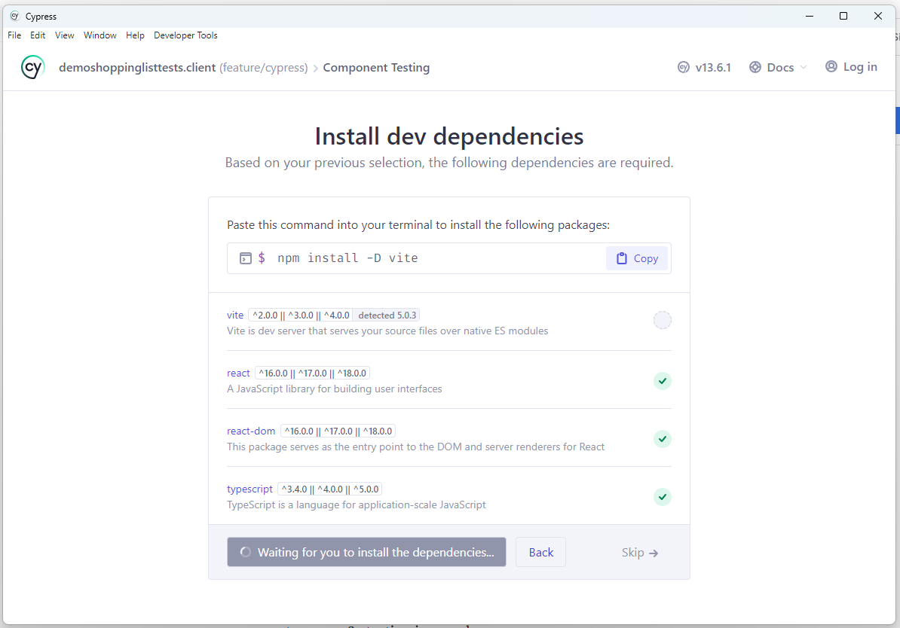
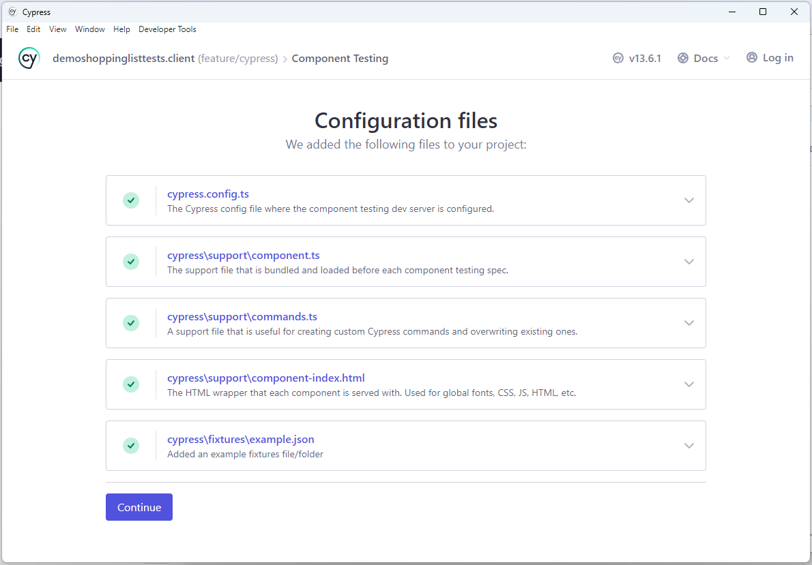

# Install Cypress

open a shell and goto the directory of the package.json file, then install cypress.

```bash
npm install cypress --save-dev
```

# Package.json - Create Shell Entry

```json
  "scripts": {
    "dev": "vite",
    "build": "tsc && vite build",
    "lint": "eslint . --ext ts,tsx --report-unused-disable-directives --max-warnings 0",
    "preview": "vite preview",
    "storybook": "storybook dev -p 6006",
    "test-storybook": "test-storybook",
    "build-storybook": "storybook build",
    "cypress": "npx cypress open"
  },
```

# Running Cypress

Run cypress via the following command

```
npm run cypress
```

The first time cypress is run within a project, it will not be configured and you will see the following screen



choose the **Component Testing** option

The wizard will detect the framework and bundler


The wizard will then prompt to install any required packages


The wizard will then confirm that it has added various files and configurations

