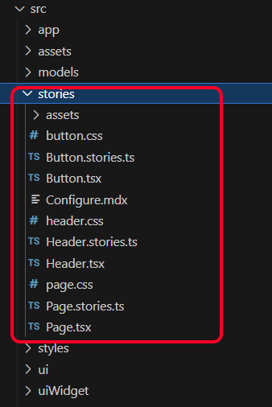

# Storybook Setup

Add storyboard to the project, you will be asked to confirm that you wish to add the storybook package to the application. Additionally if you are using ESLint, it will add storyboard lint packages.

```
npx storybook@latest init
```

# package.json

The package will have 2 new scripts

- **storybook** local interactive version of storybook that updates in realtime to code changes
- **build-storybook** create a deployable storybook

```json
  "scripts": {
    "dev": "vite",
    "build": "tsc && vite build",
    "lint": "eslint . --ext ts,tsx --report-unused-disable-directives --max-warnings 0",
    "preview": "vite preview",
    "storybook": "storybook dev -p 6006",
    "build-storybook": "storybook build"
  },
```

# Examples

The installation process will install several examples that show how to configure storybook for your own controls


