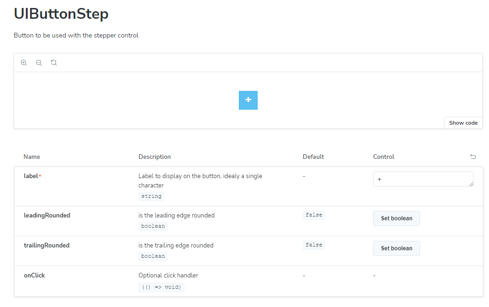

# Control Comments

Storybook will read code comments from controls and use them as part of the documentation.



## Control Description

Create a document comment for you control to be displayed in storybook

```typescript
/**
 * Button to be used with the stepper control
 */
const UIButtonStep: React.FC<IProperties> = ({
  label,
  leadingRounded = false,
  trailingRounded = false,
  onClick,
}: IProperties) => {
```

## Interface

comments on the interface will be displayed in the storybook

```typescript
interface IProperties {
  /**
   * Label to display on the button, idealy a single character
   */
  label: string;
  /**
   * is the leading edge rounded
   */
  leadingRounded?: boolean;
  /**
   * is the trailing edge rounded
   */
  trailingRounded?: boolean;
  /**
   * Optional click handler
   */
  onClick?: () => void;
}
```

## Default Values

If the input parameters are deconstructed with default values, this will be displayed in storybook

```typescript
const UIButtonStep: React.FC<IProperties> = ({
  label,
  leadingRounded = false,
  trailingRounded = false,
  onClick,
}: IProperties) => {
```
