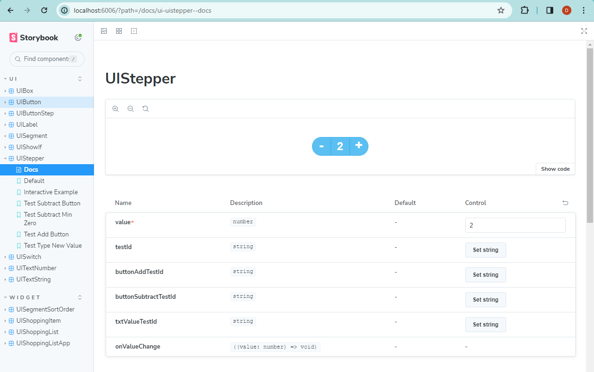

# Storybook

Storybook is a frontend workshop for building UI components and pages in isolation.

[storybook website link](https://storybook.js.org/)

## Uses

Storybook allows development of visual controls without having to create a page to host them for testing. Parameters can be amended in realtime as well as providing the facility to provide multiple previews of different states.

If can be used for automated testing, however at this time cypress provides easier and clearer functionality to perform the same task.

# Launching Storybook

```bash
npm run storybook
```


